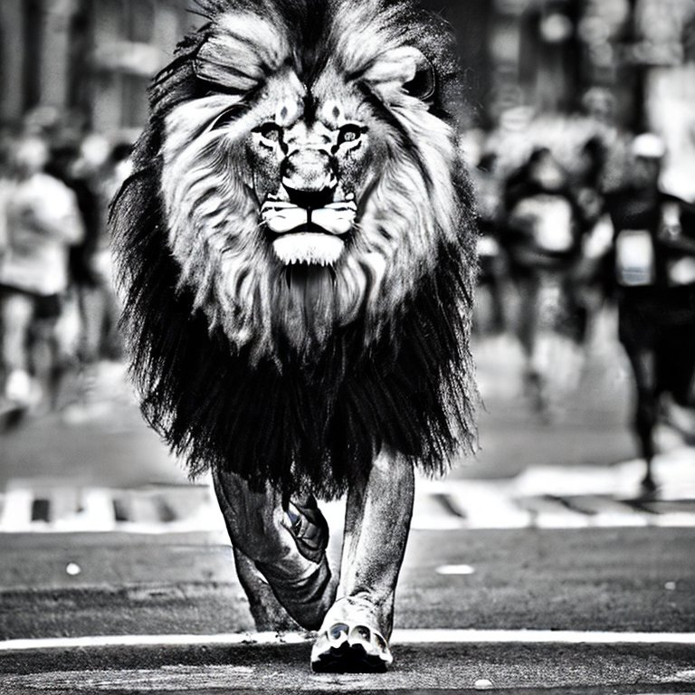
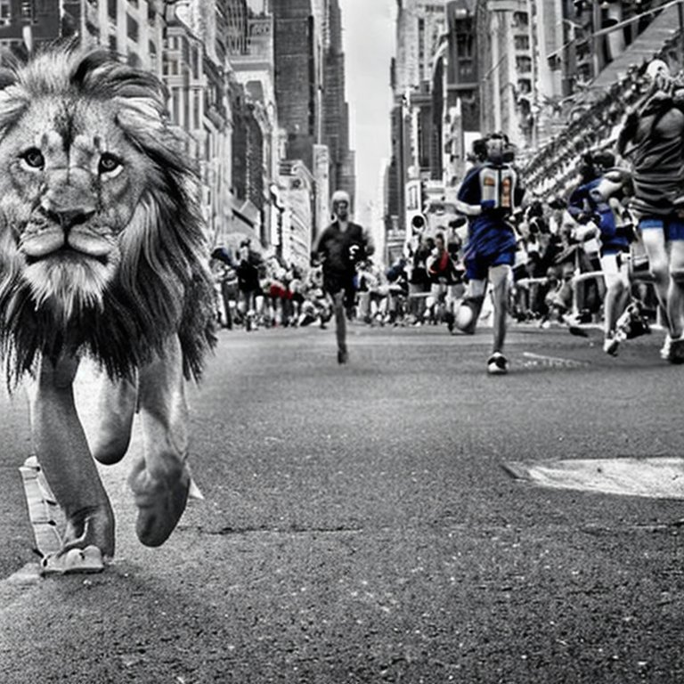

# Tree of Thought Prompts for Image Generation

This repository showcases a series of images created using the Tree of Thought (ToT) prompting technique applied to image generation using Stable Diffusion 2.1. The images are generated based on increasingly refined ToT prompts, each refining the image generation process and resulting in more predictable and higher quality images. The final ~14 images reflect the prompts in the repository. The BING images are the prompts input to the BING image creator. Unfortunately the Bing user interface truncated the prompts. Interestingly, the Stable Diffusion 2.1 outcomes with the full prompts are comparable to the BING outcomes with truncated prompts. BING uses the most up to date Dall-E 2 model. If the full prompt could be input the outcome would likely exceed Stable Diffusion 2.1 significantly. As it is the outputs are roughly comparable although Dall-E 2 is a far superior model to Stable Diffusion 2.1. The full prompt raised the quality of the inferior model outputs to bring them closer to Dall-E 2. The wide aspect ratio image uses Dall-E (ie, not Dall-E 2) to entend the image out. You can see the loss of quality in the extended portions as the ToT prompts were not used in the extention process.  

## Initial Testing, T-Rex to Lion

These images were a progressive testing of variations of ToT prompts that are not in this repository. I saved images felt to improve on previous images.

## Final Prompt 1

The first prompt focuses on creating an image of a realistic lion competing in the New York Marathon. The lion, being the central subject, is depicted as 50% larger than an average man and is portrayed at eye level. The lion's expression is focused and intense. 

The image generation process for this prompt involved a silent and secret collaboration of 20 Robert Batemans and 15 professional urban and wildlife photographers. They worked together to achieve the best outcome for the image's composition, framing, realism, emotional appeal, clarity, color balance, details, lighting, and shadows. 

The image was partitioned into 16 separate parts, each optimized at full resolution, and then consolidated into a single image. The final image was prepared to the satisfaction of all collaborators.

## Final Prompt 2

The second prompt builds upon the first one, adding more complexity to the image. This time, 2 Leonardo da Vincis join the team of Robert Batemans and professional photographers. The lion is still the central subject, but now it's depicted among humans in a wide shot.

The process of image generation remained the same as in Prompt 1, with the collaborators working silently and secretly to create the best possible image.

