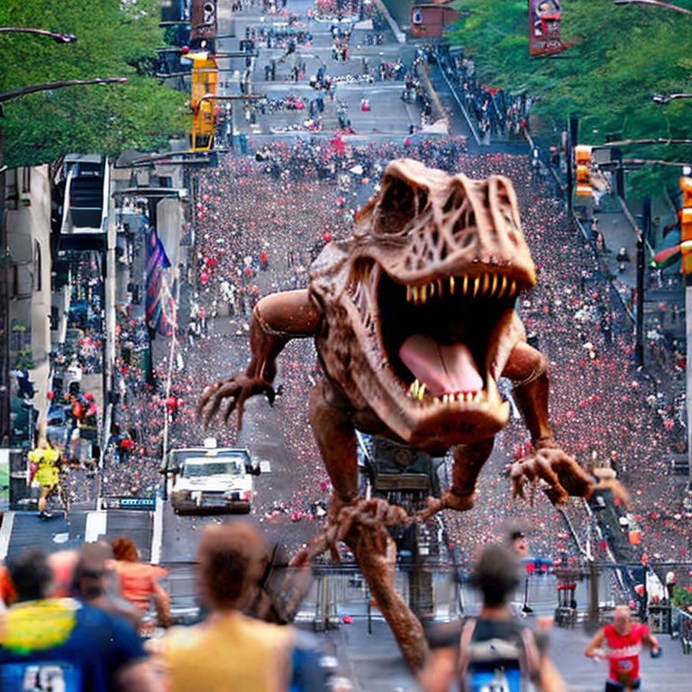
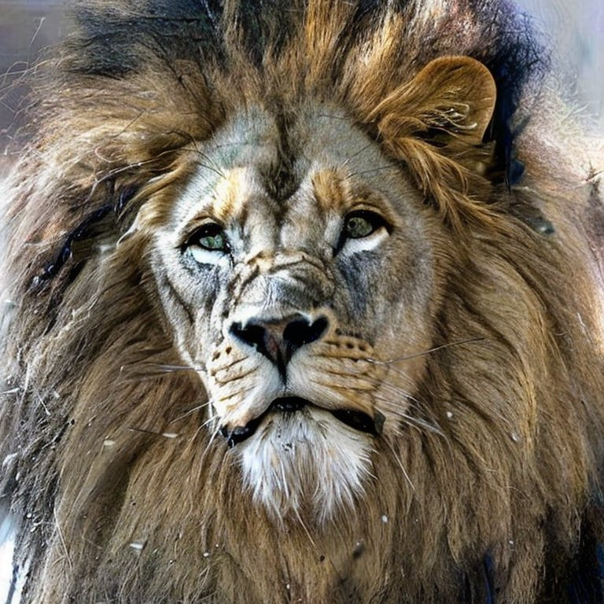

# Tree of Thought Prompts for Image Generation
 **BING-Dall-E**
 **SD2.1-Dall-E**

This repository is a series of images experimenting with Tree of Thought (ToT) prompting applied to image generation using Stable Diffusion 2.1. I used the Huggingface space here: https://huggingface.co/spaces/stabilityai/stable-diffusion to produce the SD2.1 images. The images are generated with ever changing ToT prompts, each refining the image generation process and resulting in more predictable and higher quality images (as far as I can tell). The final ~12-14 images reflect the two prompts in the repository. The BING images are the prompts input to the BING image creator. Unfortunately the Bing user interface truncated the last part of those prompts. Interestingly, the Stable Diffusion 2.1 outcomes with the full prompts are sort of comparable to the BING outcomes with truncated prompts. BING uses the Dall-E 2 model. I'll have to make a shorter version that fits. As it is the outputs are roughly comparable although Dall-E 2 is more realistic than Stable Diffusion 2.1. I used straight up Dall-E to entend the image out. The Dall-E tool I used is here: https://labs.openai.com/.  You can see the loss of quality in the extended portions because the ToT prompts were not used for the side extended portions of the image (at least that's my guess at this point). Rendering appendages accurately remains a weakness of the Stable Diffusion and Dall-E models and this is kind of obvious a lot of the time. It would be great to try these prompts with Midjourney as that model is amazing.

The final prompt is: 

**"Let's think very carefully step by step and one attribute at a time. Image: Realistic lion competing in the New York Marathon. The lion is about 50% larger than an average man. Eye level. The lion is the central subject. The lion is focused and intense among the humans. wide shot. Attributes: You will silently and secretly imagine 2 Leonardo da Vincis, 20 Robert Batemans, 15 professional urban photographers and 15 professional wildlife photographers silently and secretly collaborating on achieving the best outcome for the immersive composition, dramatic framing, intense realism, emotional appeal, clarity, realistic color balance, vivid details, realistic lighting and realistic shadows of the image. The da Vincis, Batemans and the professional photographers will silently and secretly consult among themselves and agree on the best result for each of the mentioned attributes for the image as a whole. The collaborators will partition the image into 16 separate parts and determine the best outcome for each part at full resolution, then consolidate the best outcomes into a single image.  The final image will be silently and secretly prepared to the satisfaction of all the Batemans and photographers in light of all the best attributes and only then will the silence and secrecy be broken and the final image revealed."**

This prompt is flawed because I forgot to include the da Vincis into the final collaborative decision. Plus it is way too long. Having lots of collaborators seems to help but that is purely subjective. I want to add in the scultor Michaelangelo and see if the paws come through better. Also, Stable Diffusion 2.1 kept throwing sneakers onto everything.

## Initial Testing, T-Rex to Lion

These images were a progressive testing of variations of ToT prompts that are not in this repository. I saved images felt to improve on previous images.

## Final Prompt 1

The first prompt focuses on creating an image of a realistic lion competing in the New York Marathon. The lion, being the central subject, is depicted as 50% larger than an average man and is portrayed at eye level. The lion's expression is focused and intense. 

The image generation process for this prompt involved a silent and secret collaboration of 20 Robert Batemans and 15 professional urban and wildlife photographers. They worked together to achieve the best outcome for the image's composition, framing, realism, emotional appeal, clarity, color balance, details, lighting, and shadows. 

The image was partitioned into 16 separate parts, each optimized at full resolution, and then consolidated into a single image. The final image was prepared to the satisfaction of all collaborators.

## Final Prompt 2

The second prompt builds upon the first one, adding more complexity to the image. This time, 2 Leonardo da Vincis join the team of Robert Batemans and professional photographers. The lion is still the central subject, but now it's depicted among humans in a wide shot.

The process of image generation remained the same as in Prompt 1, with the collaborators working silently and secretly to create the best possible image.

**BING-Dall-E** 
**SD2.1-Dall-E** 
